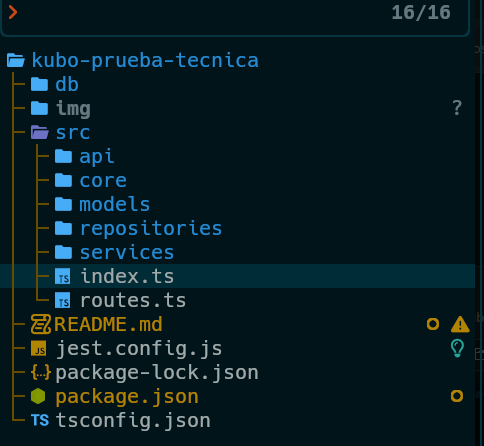

# Kubo-prueba-tecnica

## Descripción

Proyecto tipo api desarrollado en nodejs y hono, con base de datos postgreSQL y desplegado en heroku para la prueba técnica "Desarrollador Backend" en Kubo.
El objetivo es desarrollar una api que mediante endpoints pueda gestionar peliculas, categorias y usuarios en una base de datos.

Se elige el framework hono por su nativa compatibilidad con typescript, su similitud con el framework express y su sencillez de implementación ideal para este proyecto.
Para la estructura interna de las carpetas del proyecto se sigue la filosofía _screaming architecture_ en donde cada carpeta refleja la separación de responsabilidades permitiendo cumplir, en la medida de lo posible, el principio de **Single Responsability** de los principios SOLID.
Este enfoque tambien permite mejorar la escalabilidad de la API para futuras adiciones y el mantenimiento del código existente. Al agregar nuevas funcionalidades relacionadas con los dominios existentes, se sigue el patrón establecido reduciendo la complejidad y los posibles errores.



## Instalación

1. Clonar el repositorio:

```bash
git clone https://github.com/zesertebe/kubo-prueba-tecnica.git
```

2. Instalar las dependencias:

```bash
npm install
```

3. Crear el archivo de variables de entorno (.env) en la raiz del proyecto con la siguiente estructura:

```env
  BASE=la versión base de la api ej: v1,
  PORT=el puerto de la api ej: 3000,
  DB=Enum de la base de datos 0 = POSTGRESQL ej: 0,
  PG_USER=usuario_postgress(local)
  PG_PASSWORD=password_usuario_postgress(local)
  PG_PORT=puerto_postgress(local)
  PG_DB=nombre_database(local)
  PG_HOST=host_postgress o jdbc de heroku postgres
  APP_ENV=entorno de la api. 0: Local, 1: heroku
```

> [!WARNING]\
> Este archivo de variables de entorno no debería incluirse en ningún momento en el repositorio de la API ni en ningún otro repositorio así como en ningún servicio de almacenamiento o archivo adjunto de correo.

4. Ejecutar el servicio para pruebas:

```bash
npm run dev
```

5. Ejectuar el servicio (build):

```bash
npm run build && npm run start
```

## Base de datos

En local ejecutar el archivo "schema.sql" con un usuario con suficientes permisos:

```bash
sudo -u postgres psql -d kubo -f db/schema.sql
```

En el entorno de heroku se puede ejecutar el archivo "schema_heroku.sql":

```bash
sudo -u postgres psql DATABASE_URL -f db/schema_heroku.sql
```
